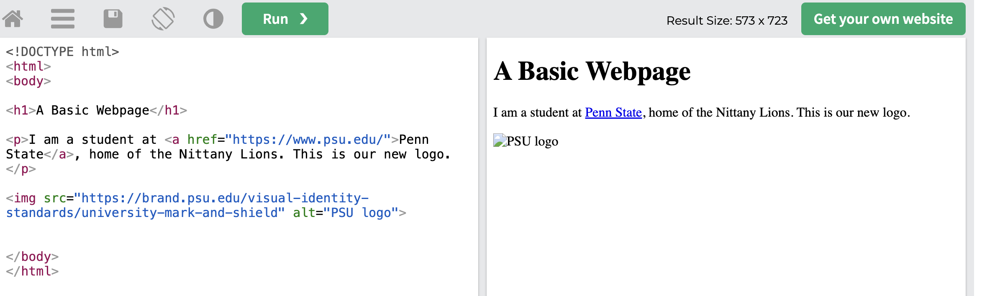
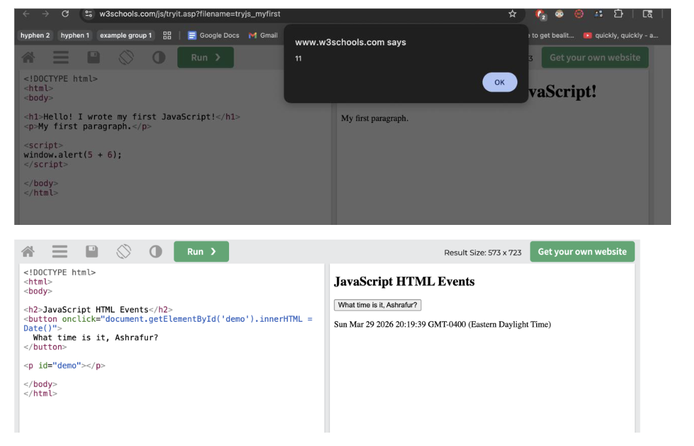

# Individual Assignments

This section contains my IST 110 individual coursework. I am organizing visual artifacts in a shared `images` folder so they can be reused cleanly across the portfolio.

### L01: Activity 1: Virtual Information Treasure Hunt

When I initially started the 'hunt' to find a scholarly article titled “discussing the impact
of information overload on decision-making", I was expecting it to be quick and easy. However,
after searching for it on https://libraries.psu.edu/ I was left with a myraid of different articles that
had some of the keywords in my search, but none of them were an exact match. I did my best to
filter the search, and applied the following filters: Scholarly & Peer-Reviewed, Search in Full
Text, and Journal Article. Using those filters, I got this as an example:
Aljanabi, A. R. A. (2023). The impact of economic policy uncertainty, news framing and
information overload on panic buying behavior in the time of COVID-19: A conceptual
exploration. International Journal of Emerging Markets, 18(7), 1614-1631.
https://doi.org/10.1108/IJOEM-10-2020-1181
This is a conceptual study that dives into how economic uncertain, information presented in the
media, and generally an excessive consumption of information lead to many people panic buying
during the covid pandemic.
To narrow my search further, I applied the “science & technology” filter under Subject Terms,
and found:
Willing, M., Ebbers, S., Dresen, C., Czolbe, M., Saatjohann, C., & Schinzel, S. (2025).
Simulating the overload of medical processes due to system failures during a cyberattack. BMC
Medical Informatics and Decision Making, 25(1), 174-13. https://doi.org/10.1186/s12911-025-
02988-8
This paper uses simulation modeling to find how workflows in the medical field get
overwhelmed by failures when cyberattacks occur and tries to identify where those bottlenecks
are.
Budde, L., Liao, S., Haenggi, R., & Friedli, T. (2022). Use of DES to develop a decision support
system for lot size decision-making in manufacturing companies. Production & Manufacturing
Research, 10(1), 494-518. https://doi.org/10.1080/21693277.2022.2092564
This article aims to produce simulations that an accurately predict what types of manifacturing
decisions to make in high-pressure scenerios.
I do think that the overall quality of these documents is very high as they are not only all peer-
reviewed, but the papers themselves are well written and comprehensive. However, even after
applying other filters to try and limit my searches, I was not able to find an exact match for the
article listed on the assignment. Overall, the results were not very relevant to the topic, as most
of my search results came up more so because the Psu library search engine detected matching
key words rather than finding an article that was closely related to what I was looking for.

### L02: Activity: Binary Representation

After watching the "Introduction to Binary Representation (10 minutes)" video, I looked around
for some other sites I could use beside the one given to practice binary conversions, but before
that, I wanted to watch another tutorial to really cement the concepts. That is when a came across
a video by the youtube channel “The Organic Chemestry Tutor”, which is a channel I trust
greatly as I’ve watched many of their videos previously. After watching that, I came across a
binary game by cisco which I found very helpful to practice on. Both links are attached below.
The significance of at least understanding the general concept of binary representation is because
it allows us to grasp how computers work at a very low level. It is essentially the language of
computers, as it utilizes bits to represnt data, control logic gates, and manage memory.
References
Binary game: https://learningnetwork.cisco.com/s/binary-game
Tutorial on how to convert binary to decimal: https://www.youtube.com/watch?v=VLflTjd3lWA

### L04: Hardware Dissection Lab

L04 Hardware Dissection Lab (iPhone 16 air
vs Nintendo 3DS)
The two devices I chose to cover were the Iphone 16 air, and the 3ds. Although I do not own that
exact iPhone model, I was really interested in the engineering that went into it when it was
announced. The advertising for it promised that the phone would be comparabily powerful to its
peers in it’s generation’s lineup, but its main claim to fame was how thin it was. I guessed that
they were likely sacrificing some storage and a lot of battery to make the phone work.
I chose the 3ds as my other option because I have owned one in the past, and I remember having
lots of fond memories with it. However, I always wanted to break it apart and see what the inside
looked like as a kid, as I had a lot of fun breaking apart old toys and TVs back then, but I liked
my console too much to break it. This assignment gives me the opportunity to scratch that itch.
iPhone 16 air dissection
This picture shows the power management system of the phone best. The main pmic is the Apple
APL1064/338S01279 power management, which is in the yellow box, the battery charger is the
Texas Instruments CP3200C1H3 battery charger which is in the green box, and the wireless
charging is the Broadcom BCM59367A1IUBG wireless charging controller which is in the
purple box. The input devices can also be seen here, port controller being the NXP
Semiconductors CBTL1701B0 USB Type-C port controller which is in the orange box and the
audio input which is the Apple/Cirrus Logic 338S00967 audio codec in the light blue box. An
output device is also shown here, the audio amplifier which is the Apple/Cirrus Logic
338S01148 audio amplifier is in the dark blue box. Finally, the hard drive which is the Kioxia
K8A7RJ5126 ? 256 GB NAND flash memory is in the dark red box.
This image shows the network adapter well. The 5G modem is the Apple APL1114/337S01030
5G modem in the red box, and the rf transceiver is the Apple APL1088/338S01150 RF
transceiver in the orange box.
This is the inner side of the main board. Some other output devices are here, with the display
power being the Texas Instruments TPS65658A0 which is in the orange box, and the flash for
the camera being the Texas Instruments CP5100A0 camera flash controller in the light blue box.
The cpu is the CPU and RAM is the Apple APL1V12/339S01839 hexa-core applications
processor w/ GPU & Neural Engine layered under a Samsung K3KLMLM0FM-HGGV 12 GB
LPDDR5X SDRAM which is in the dark red box. Finally, the pictures I chose show both sides
of the motherboard.
3DS dissection
The power supply is the 3.7V 1300mAh 5Wh Li-Ion battery
The network adapter is the Atheros AR6014 IC
The input devices are the circle pad analog joystick, which is behind the white plastic.
This shows the entire motherboard, the cpu is the Nintendo 1048 0H ARM CPU in dark red, the
ram is the Fujitsu MB82M8080-07L 128MB FC-RAM in orange, the hard drive is the Toshiba
THGBM2G3P1FBAI8 2 GB NAND Flash in yellow, and some more input devices are in purple
and black, which are the gyroscope and accelerometer respectively.
The bottom screen is both and input and output device.
Stereo speakers as other output devices
Top screen is purely an output device.
Discussion:
I would say that overall, the devices are built just about as I expected. The parts on the iPhone
were a lot easier to navigate, as every key piece was on one side or another of the main
motherboard. The 3ds however seemed to be a more complex system to decipher. That is
because it had quite a few parts scattered on both the top and bottom half of the device, and had
more input than just a touch screen. Overall, though, the motherboards for both do have some
similarities, and that is to be expected, but both devices serve distinct purposes which are
reflected in the differences in their designs.

### L05: Choose the Best OS

As a tech consultant, here are the suggestions I have regarding what type of companies should
adopt which operating system.
1. Windows (Microsoft)
Pros:
Windows can run just about every business, admin, and industry-specific software that is out
there. Its compatibility with a multitude of different workflows is unmatched.
Windows also has a wide range of devices that firms can chose from that fit for just about every
price point imaginable.
While this can be said for all the other operating systems listed here, Windows arguebly does the
best job at maintaining security policies and offers the most comprehensive remote management
tools in the market.
Cons:
While having comprehensive security policies is a plus, it is also often the primary target for
malicious cyber attacks, as it is the most popular operating system. This means that hackers have
a wider net they can cast when executing their attacks.
Windows is notoriously known for coming with a lot of “bloatware”, which is another way of
referring to unwanted/unnecessary software and features in their operating systems, which can
make the user experience sluggish.
2. macOS (Apple) Pros:
MacOS offers the most optimized workflow for industries that value and make use of creative
suites (think Adobe creative cloud and other photo/video editing software).
Because it is a Unix-based system, the OS is known for being more secure without needing as
much setup as Windows, and it carries that reputation among firms and individual users alike.
Ecosystem Integration: Seamlessly connects with iPhones and iPads, which is a major
productivity boost for mobile-heavy teams.
Apple’s ecosystem is unmatched when it comes to how integrated their set of devices can be. A
user can seamlessly switch between their iPhone, iPad, laptop/desktop, all the while having the
same set of headphones in their ear.
Cons:
Out of the three systems listed here, MacOS generally has the highest cost of entry due to the OS
mainly being designed and used on Apple hardware.
Apple also offers the least amount of fine-tuning and customization when it comes to how their
OS works and what changes they allow users to make.
3. Linux (Open Source) Pros:
Perhaps the biggest advantage with Linux is that it is completely free, forever, regardless of what
version and what update a user may want.
Linux also offers the most amount of control to its users, with just about every aspect of the OS
being customizable, and it can be designed to run only on select servers if the firm chooses to set
it up that way. While many of these things are possible on other OS, it is not nearly as easy.
Resource Efficient: Can "revive" older hardware that struggles to run modern Windows or
macOS.
It is the least hardware intensive, meaning a firm can choose to pay even less for hardware, and
with the OS itself also being free, Linux easily becomes the most affordable option.
Cons:
Software Gap: Does not natively support major industry tools like Adobe Creative Suite or
Microsoft Office desktop apps.
The biggest flaw with Linux is that it can be hard to run many first-party or industry standard
applications (like Adobe creative cloud mentioned earlier or Microsoft Office suite). However, it
does have quite a few open-source alternative options which are generally free.
It is the most technically challenging OS to not only use, but to troubleshoot and maintain as
well.
Linux would be best for nonprofits as they offer the cheapest barrier to entry, with the OS itself
and much of the software that they would need being available for free, with the most affordable
hardware prices to boot.
MacOS would easily be the best for a social media agency, as it works the best with those
creative set of tools mentioned earlier, and offers a seamless experience.
Windows would be best for an interior design firm, as it would likely support all the industry-
standard applications needed for its employees to work effectively.

### L07: CODIS Cold Case

I chose to cover the report “30-Year-Old Murder Solved. Fingerprint Technology Played Key
Role" (link: https://www.fbi.gov/news/stories/30-year-old-murder-solved) which goes over the
FBI report regarding the murder of Carrol Bonnet in 1978
What role did DNA sampling play in solving the case?
In this case, DNA was the final confirmation that investigators needed to confirm the suspect's
identity. The case was initually resolved when the FBI's database used fingerprints to check, but
the DNA samples were the final nail in the coffin.
How and when was the DNA collected?
The investigators collected evidece from the victim's bathroom and car right after the crime in
1978, and in 2008 they obtained a new DNA sample from the cell that the murderer was kept in
to confirm the match.
What should be done with DNA samples from persons who are not convicted of a crime?
This article is focused on an actual convicted person, but in general the FBI's broader policy is
that DNA profiles in national databases are for law enforcement to use only.

### L07: Music Genome Project

The Music Genome Project was founded in 1999 by Will Glaser and Tim Westgren, who are the
team behind Pandora radio. The data relies on human expertise rather than just advanced
algorithms, with trained musicians who listen and break down songs. The gene system then puts
the attributes of these songs into their data bank so it can be used to identify other songs. Once a
song has been broken down, it becomes a multi-dimensional vector in a massive mathematical
map, and then matching and recommendation algorithms use that data, and a feedback loop
system refines it.
The band I picked was "Third Eye Blind", and the the following songs in the station were in that
same grunge/rock genre. The station started with the song “Graduate” which is one of their
bigger songs, and the following artists were closey related to them. The songs did make sense
together and I could see them all being in the same playlist. The clue this gives about their
database is that it sorts not only by the genre of the artist, but also what other artists people who
like this one listen to and if they listen to them consecutively.

### L08: Activity 2: OSINT

### L09: JavaScript

First example is JS output, the second is activated by a user interaction with the onclick event
listener.
The best choice between the if and if else depends on the number of outcomes you need to
handle. If statements are best for a yes/no check, but if else can be added repeated, and allows for
handeling more complex situations. 

### L11: What do Companies Know About You?

L11 What do Companies Know About You? What kinds of information about yourself are
you giving away when you use apps like Facebook, Instagram, Twitter, and Snapchat?
When I'm using social media apps, I was always aware in the back of my mind that I was
giving away some personal information, but felt that it was a reasonable amount amount,
and that working to prevent that information being shared to them was not worth missing
out on using these apps. Upon researching further, most of the information I found did not
surprise me. Of course some basic info like my name, birthday, email and phone number
and the photos I upluaded would be viewable, but companies also work to store lots of
metadata on how a user is interacting with their app, what sort of content they like or
dislike, the retention on certain media, etc. They also have access to biometric info, which
is the most concerning to me but it seems to be used for technologies like facial
recognition, but could be used for malicious applications such as tagging photos with
specific people.
What information did you find in the Personal Information and Privacy section on Google?
Google has a detailed history of my web and app activity, like my google searches and
chrome browsing history. They have my location history of where I've been with my mobile
device, my watch history on youtube, and my ad settings that profile my interests. It is a lot
of information and honestly feels quite invasive, which is part of the reason why I don’t
browse on Chrome.
Did you find any information about yourself when you googled your name? Do you have a
common name that gives you lots of results or an uncommon one that nets you fewer?
I don’t have a very common name when it comes to the U.S, but in Bangladesh and South
Asia my name is more common. When I look myself up, I find lots of people with the same
name as me for different articles or profiles on social media. After some digging, I found
myself on LinkedIn through the regular search on Brave, but found myself significantly
faster on goggle.
What two sites did you try? Did you find any additional information about yourself? Was it
correct? Is there a way to have the entry removed from the site?
When I used my full name, I found a YouTube video I had made for my former middle
school, pictures of myself from competitions, and my profile on Linkedin. However, since
my other social media is set to private I did not seem to pop up for those. These were all
correct and I don’t need them to be removed. If I did want these removed though, I would
have to contact YouTube support and the author of the articles to take them down.

### L12: Cybercrime Assignment

How To Handle Cybercrimes
I believe punishment for cybercrimes, particularly those by first-time and lower-harm
offenders, should primarily focus on rehabilitating the offender. This rehabilitative approach to
punishing cybercrime is fitting due to the fact that most cybercrime offenses require some level
of technical ability; therefore, the technical skills used to commit these crimes could easily be
directed towards lawful employment (The University of Arizona, 2023).
Rehabilitation is a more effective way to punish cybercrime offenders (and reduce
recidivism) than a punitive-only approach. Sentencing research regarding cybercrime shows that
rehabilitation was one of the primary goals of sentencing. Additionally, research indicates that
using reformative approaches will lead to less recidivism rates, and convert the technical
capabilities used in committing illegal acts into lawful abilities (The University of Arizona,
2023). In addition, a report recently released concerning youth cybercrime states that punishment
alone does nothing to prevent future offending, whereas diversionary programs, mentoring, and
vocational training provide youth with a pathway to move beyond offending.
This reasoning is important since much of what constitutes cybercrime is learned
behavior, access to computers and/or systems, and opportunity -- all of which can be changed.
The strongest counter argument to my position is that cybercrime causes significant
financial harm and/or personal harm to individuals/victims, and therefore punishments should
aim at deterring such behaviors and providing retribution. While this perspective holds merit
when dealing with high-level cyber-fraudulent activity (identity theft), or repeat-intrusion type
cyber-activities, there are still ways to maintain a rehabilitative-centered approach while
including restitution, monitoring/supervision, and limiting access to computer systems (The
University of Arizona, 2023). Therefore, a rehabilitative-centered approach to punishment can
still "bite" without being merely decorative.
A rehabilitative-centered approach is even more relevant when dealing with juvenile
offenders. Juvenile Justice Systems typically have as their primary focus rehabilitation rather
than punishment. As such, juvenile offenders' cyber-related offenses are usually best served
through educational/counseling services, and structured diversion programs rather than through
adult-style sentencing (The University of Arizona, 2023). Ultimately, this approach
acknowledges that a minor who hacked into a school's computer system and an adult running a
fraudulent scheme belong in different areas of the law/justice system.
This paper argues that punishment for cybercrime should focus on rehabilitation because
it reduces recidivism, fits the technical nature of many offenses, and works better for juveniles
and lower risk offenders. Strong cases should still involve restitution and meaningful restrictions.
The goal is accountability with a future attached, which is a rare but useful arrangement.
References
Khadam, N., Anjum, N., Alam, A., Ali Mirza, Q., Assam, M., Ismail, E. A. A., & Abonazel, M.
R. (2023). How to punish cyber criminals: A study to investigate the target and
consequence based punishments for malware attacks in UK, USA, China, Ethiopia &
Pakistan. Heliyon, 9(12), e22823. https://doi.org/10.1016/j.heliyon.2023.e22823

### L13: Enterprise Technology Integration Assignment 

Walmart, Retail. AI, automation, and e-commerce technologies help Walmart optimize
inventory management, workforce scheduling, and delivery. Technologies cut down costs,
enhance efficiency, and help Walmart function as a people-oriented yet technology-driven
business.
https://finance.yahoo.com/news/walmart-touts-early-ai-wins-150700651.html
Amazon, E-commerce and Cloud Computing. Technologies such as automation,
predictive analytics, and artificial intelligence are used by Amazon in its retail operations
and AWS services. The use of technologies has enabled Amazon to boost its revenues and
operating profit while growing at an optimal pace.
https://rsisinternational.org/journals/ijriss/articles/digital-transformation-and-supply-
chain-efficiency-a-case-of-amazon-inc/
Tesla, Automotive and Clean Energy. AI, software, and computer vision are used by Tesla
for manufacturing and within the vehicles themselves. The adoption of technologies not
only enhances production efficiency but generates additional revenue through software
and other related services.
https://finance.yahoo.com/news/tesla-profit-tanked-46-2025-211611664.html

