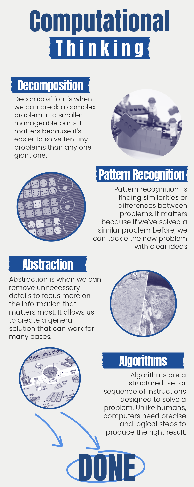
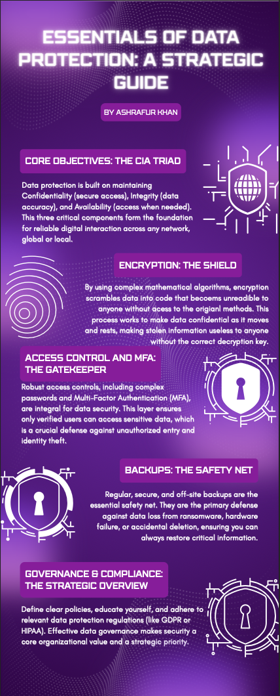

- [Home](./index.md)

## Infographics

This subsection highlights infographic-based assignments. Each entry includes the title, the visual artifact, and a short reflection on what I learned from creating it.

### L03 Computational Thinking

This infographic explains four core parts of computational thinking: decomposition, pattern recognition, abstraction, and algorithms.

**Reflection:** While creating my infographics, I focused on turning technical ideas into something visually simple and easy to understand. This one coveres the basic of computatonal thinking. 

## L10: Activity 3: Infographic on a Security Concept

**Reflection:**
For this infographic, I covered the essentials of data protecion and chose to write it as if it were a guide both for users and companies. The concepts can be applied for a wide range of use cases and cover the core concepts of data protection. 
